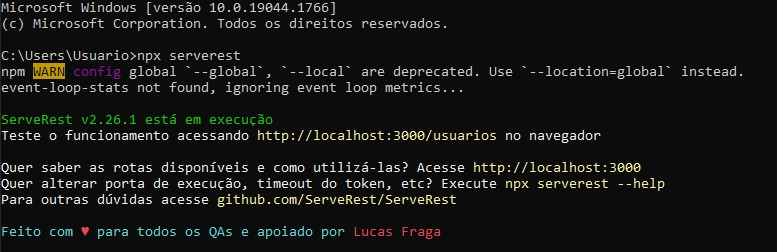
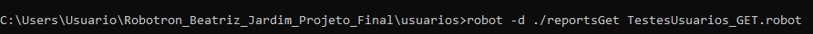
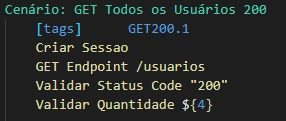

# Trilha RoboTron - Projeto Final

  

* Esse repositório é composto por testes desenvolvidos com o **Robot Framework**.
* Os testes que compõem esse projeto foram escritos através da IDE **VS Code**.
* A ferramenta **Git** foi usada para transformar o projeto em um repositório e depois armazená-lo no GitHub.

## Características do Projeto

Os testes que compõem esse projeto foram organizados em pastas, cada uma contém os testes feitos para o endpoint que dá nome à pasta. Além disso, os testes estão divididos por requisições e os testes correspondentes a cada tipo de requisição (GET, POST, PUT e DELETE) são encontrados em arquivos diferentes.
Em cada arquivos estão os Test Cases para sua respectiva requisição, entr esses Test Cases estão os cenários de Sucesso (com status 200) e de Erro (com status 400).

Além desses arquivos principais, também temos a pasta *midia*, que contém as imagens presentes nesse documento, e os arquivos *JSON* que são compostos por objetos desenvolvidos para servirem de dados para testes que envolvem criar e editar um usuário, produto ou carrinho.

## Como criar uma cópia desse projeto

Para obter uma cópia desse projeto em sua máquina local, siga os passos abaixo:

1. Crie um *Fork* desse projeto no seu perfil do GitHub
2. Instale a IDE de sua preferência* que seja compatível com a linguagem Python ([Aqui](https://blog.geekhunter.com.br/ides-e-editores-de-codigo-em-python-para-2021/) estão algumas opções).
3. Instale a versão do [Git](https://git-scm.com/downloads) compatível com seu sistema operacional.
4. Depois de [configurar o Git](https://www.youtube.com/watch?v=UBAX-13g8OM) em sua máquina, rode o seguinte código:

<code>
$ git clone https://github.com/BeatrizJardimm/RoboTron_Beatriz_Jardim_Projeto_Final.git

</code>

Agora você tem uma cópia dos exercícios em sua máquina! :)

*Eu utilizei o **VS CODE**, e a partir [desse artigo](https://asimov.academy/como-instalar-e-configurar-o-vscode/) ou [desse vídeo](https://www.youtube.com/watch?v=-RuY-rM-B4M&t=1s) você pode configurar tal IDE pra executar arquivos na linguagem Python.

## Como rodar o projeto

Primeiramente, abra o Prompt de Comando de seu computador e rode o código <code>npx serverest</code> para alocar a API trabalhada nesse projeto em sua máquina local.
 
Quando você rodar esse código pela primeira vez, a API Serverest será instalada, porém você PRECISA rodar esse comando toda vez que for realizar algum teste, pois é a partir dela que a API é inicializada. Os testes não irão funcionar se esse comando não for rodado. Além disso, esse prompt deve permanecer aberto durante o tempo de execução dos testes.
 
O console deve ficar parecido com o da imagem abaixo:

Depois disso, em outro Prompt de Comando, entre com o caminho para o arquivo de teste que você deseja rodar e, quando esse caminho estiver correto, para rodar o arquivo, você deve entrar com
 
<code>robot -d ./reports nome_arquivo.robot</code>
 
Para exemplificar, abaixo temos uma imagem do console com o comando para rodar os testes das requisições GET do endpoint /usuarios

Além disso, caso você queira rodar apenas um caso de teste específico, sem precisar rodar todos os Test Cases do arquivo, você pode digitar <code>robot -d ./reports -i tag nome_arquivo.robot</code> no seu console, onde "tag" deve ser substituido pela tag do Test Case que você deseja rodar. As tags de um Test Case podem ser encontradas na primeira linha deste, como no exemplo abaixo:

Neste caso, o comando que você deve digitar em seu console é
 
<code>robot -d ./reportsGET -i GET200.1 TestesUsuarios_GET.robot</code>

A partir disso, você pode realizar testes em qualquer endpoint para o tipo de requisição de sua escolha!

## Nota

O erro 403 ('rota exclusiva para administradores') é o mesmo para todas as rotas onde esse erro é possível, então ele está sendo testado apenas uma vez, [nesse arquivo](produtos/TestesProdutos_DELETE.robot)

## Autora

Meu perfil no [GitHub](https://github.com/BeatrizJardimm).
 
Meu perfil no [LinkedIn](https://www.linkedin.com/in/paula-beatriz-jardim-11882521a/).