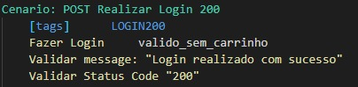

# Trilha RoboTron - Projeto Final

 
  

* Este repositório é composto por testes desenvolvidos com o **Robot Framework** para a API **ServeRest**.
* Os testes que compõem esse projeto foram escritos através da IDE **VS Code**.
* A ferramenta **Git** foi usada para transformar o projeto em um repositório e depois armazená-lo no GitHub.

##  Características do Projeto

Este projeto é composto por um conjunto de testes para os endpoints da [API ServeRest](https://serverest.dev/).
 

Os arquivos desenvolvidos para este projeto estão organizados da seguinte forma:

| Pasta | Descrição |
| :---: | :---: |
| [keywords](./keywords/) | Arquivos onde foram desenvolvidas as Keywords dos Test Cases para cada endpoint. |
| [midia](./midia/) | Pasta que contém os arquivos de imagem utilizados no presente documento. |
| [outros](./outros/) | Composta por mapas mentais e uma lista dos Test Cases desenvolvidos. |
| [support](./support/) | Contém o arquivo *base.robot* que é utilizado para setar as bibliotecas e arquivos importados para o projeto inteiro. |
| [common](./support/common/) | Pasta composta pelos arquivos com keywords e funções utilizadas por mais de um ou todos os arquivos de Test Cases. |
| [fixtures](./support/fixtures/) | Armazena os arquivos de massa de dados, estáticas e dinâmicas. |
| [variaveis](./support/variaveis/) | Contém um arquivo apenas para setar as variáveis utilizadas ao longo do projeto. |
| [tests](./tests/) | Aqui é onde encontramos os casos de teste do projeto (tanto positivos quanto negativos). Cada Endpoint tem seu arquivo específico. |

Além dos arquivos encontrados em pastas, no escopo global do projeto encontramos a licence utilizada e o documento que você está lendo!
 

Por último, também desenvolvi mapas mentais com base na API Serverest. O primeiro mapa foi feito a partir da [documentação](https://serverest.dev/) dessa API, e mostra todos os Status Codes e retornos documentados para cada tipo de requisição.

    

Porém, durante o desenvolvimento dos testes, percebi alguns bugs em relação à documentação. Algumas requisições não retornam as mensagens documentadas e, em outros casos, o Status Code esperado de acordo com a documentação não é o mesmo retornado pela API. Com base nisso, após finalizar todos os casos de teste, desenvolvi outro mapa mental com base no que a API entrega: 

    

Os arquivos correspondentes aos mapas mentais acima podem ser encontrados na pasta [outros](./outros/) juntamente com o arquivo que lista todos os [Casos de Teste](./outros/CasosDeTeste.txt) desenvolvidos.

##  Como criar uma cópia desse projeto

Para obter uma cópia desse projeto em sua máquina local, siga os passos abaixo:

1. Crie um *Fork* desse projeto no seu perfil do GitHub
2. Instale a IDE de sua preferência* que seja compatível com a linguagem Python ([Aqui](https://blog.geekhunter.com.br/ides-e-editores-de-codigo-em-python-para-2021/) estão algumas opções).
3. Instale a versão do [Git](https://git-scm.com/downloads) compatível com seu sistema operacional.
4. Depois de [configurar o Git](https://www.youtube.com/watch?v=UBAX-13g8OM) em sua máquina, rode o seguinte código:

<code>
$ git clone https://github.com/BeatrizJardimm/RoboTron_Beatriz_Jardim_Projeto_Final.git

</code>

Agora você tem uma cópia dos exercícios em sua máquina! :)

*Eu utilizei o **VS CODE**, e a partir [desse artigo](https://asimov.academy/como-instalar-e-configurar-o-vscode/) ou [desse vídeo](https://www.youtube.com/watch?v=-RuY-rM-B4M&t=1s) você pode configurar tal IDE pra executar arquivos na linguagem Python.

### Configuração do VSCode

Como já foi dito anteriormente, utilizei a IDE VSCode para desenvolver esse projeto, e algumas extensões dessa IDE foram indispensáveis para a organização e o realçamento do código. Recomendo o uso destas extenções para facilitar o desenvolvimetno deste e de outros projetos, segue uma lista com todas as extensões utilizadas:

* Robot Framework Intellisense
* Python (Intellisense oficial)
* Hyper Term Theme
* Material Icon Theme
* Rainbow Brackets
* Tabnine AI autocomplete

##  Como rodar o projeto

Primeiramente, você precisa ter o [Python instalado](https://www.python.org/downloads/) em sua máquina (estou usando a versão 3.8.2).
 
Depois disso, instale o [Node.js](https://nodejs.org/en/download/) na versão LTS.
 
Para verificar se ambos foram instalados corretamente, é só abrir seu console e entrar com os comandos <code>python -v</code> e <code>node -v</code>, assim você verifica qual é a versão na qual foram instalados.
 
 
Agora, para instalar o Robot Framework para Windows, vamos utilizar o pip install do Python, então, abra novamente seu Prompt de Comando e entre com <code>pip install robotframework</code>.
 
Caso seu sistema operacional não seja Windows, você pode encontrar o modo de instalação correto para sua máquina através desse [link](https://robotframework.org/robotframework/latest/RobotFrameworkUserGuide.html#installation-instructions).
 
Rode <code>robot --version</code> para verificar se este framework foi instalado corretamente e qual é a sua versão.
 
 
Nesse projeto, utilizamos algumas libraries do Robot Framework e, para instalar essas bibliotecas, entre com os seguintes comandos em seu console:
 
<code>pip install robotframework-browser </code>
 
<code>pip install robotframework-requests</code>
 
<code>pip install robotframework-faker</code>
 
Tenha em mente que todas essas libraries são essenciais e, caso alguma delas não esteja devidamente instalada, o projeto não será executável.

Agora, abra o Prompt de Comando de seu computador e rode o código <code>npx serverest</code> para alocar a API trabalhada nesse projeto em sua máquina local.
 
Quando você rodar esse código pela primeira vez, a API Serverest será instalada, porém você PRECISA rodar esse comando toda vez que for realizar algum teste, pois é a partir dele que a API é inicializada. Os testes não irão funcionar se esse comando não for rodado. Além disso, esse prompt deve permanecer aberto durante o tempo de execução dos testes.
 
 
Durante a execução dos testes, o console deve ficar parecido com o da imagem abaixo:

    

Depois disso, em outro Prompt de Comando, entre com o caminho para o arquivo de teste que você deseja rodar e, quando esse caminho estiver correto, para rodar o arquivo você deve entrar com:
 
<code>robot -d ./reports nome_arquivo.robot</code>
 
Para exemplificar, abaixo temos uma imagem do console com o comando para rodar os testes do endpoint /login:

    

Além disso, caso você queira rodar apenas um caso de teste específico, sem precisar rodar todos os Test Cases do arquivo, você pode digitar <code>robot -d ./reports -i tag nome_arquivo.robot</code> no seu console, onde "tag" deve ser substituido pela tag do Test Case que você deseja rodar. As tags de um Test Case podem ser encontradas tanto no arquivo de [Casos de Teste](./outros/CasosDeTeste.txt) quanto na primeira linha de um Test Case, como no exemplo abaixo:

    

Neste caso, o comando que você deve digitar em seu console é
 
<code>robot -d ./reports -i LOGIN200 login_testes.robot</code>

Ao rodar os testes no console, o retorno será algo parecido com: 

    

Onde a primeira e última linhas apresentam o nome do Test Case, a mensagem de retorno é aquela retornada pela API e o Status Code retornado também é enviado pela API. Caso esses retornos sejam compatíveis com o esperado pelo Test Case em questão, recebemos em verde a mensagem PASS, como é visto na imagem, caso contrário, em vez disso teremos a mensagem FAIL em vermelho.
 

A partir disso, você pode realizar testes em qualquer endpoint para o tipo de requisição de sua escolha!

##  Bugs

Ao longo do processo de desenvolvimento, encontrei alguns bugs relacionados à documentação da API:

* Na documentação, o Endpoint /login apresenta status de erro 400, porém, se tentarmos realizar os testes esperando esse status de retorno, vamos encontrar um erro, pois na verdade o status que está sendo retornado é 401, então, para contornar a situação, eu adaptei o código para esperar o status 401 como retorno.

* Outro bug que encontrei no endpoint /login foi que o erro 400 não está documentado, porém se tentarmos realizar um login com um usuário sem email ou sem senha, esse erro é retornado acompanhado da mensagem "email/password não pode ficar em branco", então criei casos de testes para ambos os casos.

* Além disso, na requisição POST do endpoint /usuarios e de /produtos acontece a mesma coisa, então criei os testes para esses erros apesar deles não serem referenciados na documentação.

* Por último, na requisição DELETE de /carrinhos/cancelar-compra a documentação mostra as mensagens "Registro excluído com sucesso | Não foi encontrado carrinho para esse usuário" como possibilidades de retorno, porém quando testamos excluir um carrinho que existe o retorno é "Registro excluído com sucesso. Estoque dos produtos reabastecido"

##  Reports

Nessa seção, criei uma tabela para cada endpoint que lista todos os casos de teste desenvolvidos no endpoint em questão, mostrando qual é o retorno esperado desse teste (com base na documentação) e o que o teste realmente retornou. A coluna "Etiqueta" apresenta um quadrado na cor verde para quando o retorno do teste é o mesmo que o retorno esperado e em vermelho para os casos contrários.

* /login

| Etiqueta | Objetivo do Teste | Resultado Esperado | Resultado Obtido |
|   :---:  |       :---:       |        :---:       |       :---:      |
|  | POST - Sucesso no login | Status Code: 200   "message": "Login realizado com sucesso" e Token de Acesso | Status Code: 200   "message": "Login realizado com sucesso" e Token de Acesso |
|  | POST - Realizar login sem email | Não Documentado | Status Code: 400   "email": "email não pode ficar em branco" |
|  | POST - Realizar login sem senha | Não Documentado | Status Code: 400   "password": "password não pode ficar em branco" |
|  | POST - Email Inválido | Status Code: 400   "message": "Email e/ou senha inválidos" | Status Code: 401   "message": "Email e/ou senha inválidos" |
|  | POST - Senha Inválida | Status Code: 400   "message": "Email e/ou senha inválidos" | Status Code: 401   "message": "Email e/ou senha inválidos" |

* /usuarios

| Etiqueta | Objetivo do Teste | Resultado Esperado | Resultado Obtido |
|   :---:  |       :---:       |        :---:       |       :---:      |
|  | GET - Listar usuários cadastrados | Status Code: 200   Lista com todos os usuários | Status Code: 200   Lista com todos os usuários |
|  | GET - Buscar usuário por ID | Status Code: 200   Cadastro do Usuário | Status Code: 200   Cadastro do Usuário |
|  | GET - Buscar ID de usuário que não existe | Status Code: 400   "message": "Usuário não encontrado" | Status Code: 400   "message": "Usuário não encontrado" |
|  | POST - Cadastrar usuário | Status Code: 201   "message": "Cadastro realizado com sucesso" e ID gerada para o usuário | Status Code: 201   "message": "Cadastro realizado com sucesso" e ID gerada para o usuário |
|  | POST - Cadastrar usuário com Email já cadastrado | Status Code: 400   "message": "Este email já está sendo usado" | Status Code: 400   "message": "Este email já está sendo usado" |
|  | POST - Cadastrar usuário sem email | Não Documentado | Status Code: 400   "email": "email não pode ficar em branco" |
|  | POST - Cadastrar usuário sem senha | Não Documentado | Status Code: 400   "password": "password não pode ficar em branco" |
|  | PUT - Editar usuário | Status Code: 200   "message": "Registro alterado com sucesso" | Status Code: 200   "message": "Registro alterado com sucesso" |
|  | PUT - Criar um usuário | Status Code: 201   "message": "Cadastro realizado com sucesso" e ID do novo usuário | Status Code: 201   "message": "Cadastro realizado com sucesso" e ID do novo usuário |
|  | PUT - Editar para um Email já cadastrado | Status Code: 400   "message": "Este email já está sendo usado" | Status Code: 400   "message": "Este email já está sendo usado" |
|  | DELETE - Excluir usuário | Status Code: 200   "message": "Registro excluído com sucesso" | Status Code: 200   "message": "Registro excluído com sucesso" |
|  | DELETE - Excluir usuário que não existe | Status Code: 200   "message": "Nenhum registro excluído" | Status Code: 200   "message": "Nenhum registro excluído" |
|  | DELETE - Excluir usuário com carrinho cadastrado | Status Code: 400   "message": "Não é permitido excluir usuário com carrinho cadastrado" e ID do Carrinho | Status Code: 400   "message": "Não é permitido excluir usuário com carrinho cadastrado" e ID do Carrinho |

* /produtos

| Etiqueta | Objetivo do Teste | Resultado Esperado | Resultado Obtido |
|   :---:  |       :---:       |        :---:       |       :---:      |
|  | GET - Listar produtos cadastrados | Status Code: 200   Lista com todos os produtos | Status Code: 200   Lista com todos os produtos |
|  | GET - Buscar produto por ID | Status Code: 200   Cadastro do Produto | Status Code: 200   Cadastro do Produto |
|  | GET - Buscar ID de produto que não existe | Status Code: 400   "message": "Produto não encontrado" | Status Code: 400   "message": "Produto não encontrado" |
|  | POST - Cadastrar produto | Status Code: 201   "message": "Cadastro realizado com sucesso" e ID gerada para o produto | Status Code: 201   "message": "Cadastro realizado com sucesso" e ID gerada para o produto |
|  | POST - Cadastrar produto com nome que já existe | Stauts Code: 400   "message": "Já existe produto com esse nome" | Stauts Code: 400   "message": "Já existe produto com esse nome" |
|  | POST - Cadastrar produto sem nome | Não Documentado | Status Code: 400   "nome": "nome não pode ficar em branco" |
|  | POST - Cadastrar produto com preço inválido | Não Documentado | Status Code: 400   "preco": "preco deve ser um número" |
|  | POST - Token Ausente | Status Code: 401   "message": "Token de acesso ausente, inválido, expirado ou usuário do token não existe mais" | Status Code: 401   "message": "Token de acesso ausente, inválido, expirado ou usuário do token não existe mais" |
|  | POST - Token Inválido | Status Code: 401   "message": "Token de acesso ausente, inválido, expirado ou usuário do token não existe mais" | Status Code: 401   "message": "Token de acesso ausente, inválido, expirado ou usuário do token não existe mais" |
|  | POST - Token Expirado | Status Code: 401   "message": "Token de acesso ausente, inválido, expirado ou usuário do token não existe mais" | Status Code: 401   "message": "Token de acesso ausente, inválido, expirado ou usuário do token não existe mais" |
|  | POST - Token de usuário que não existe mais | Status Code: 401   "message": "Token de acesso ausente, inválido, expirado ou usuário do token não existe mais" | Status Code: 401   "message": "Token de acesso ausente, inválido, expirado ou usuário do token não existe mais" |
|  | POST - Rota exclusiva para administradores | Status Code: 403   "message": "Rota exclusiva para administradores" | Status Code: 403   "message": "Rota exclusiva para administradores" |
|  | PUT - Editar produto | Status Code: 200   "message": "Registro alterado com sucesso" | Status Code: 200   "message": "Registro alterado com sucesso" |
|  | PUT - Criar um produto | Status Code: 201   "message": "Cadastro realizado com sucesso" e a ID do novo produto | Status Code: 201   "message": "Cadastro realizado com sucesso" e a ID do novo produto |
|  | PUT - Editar para um nome já cadastrado | Status Code: 400   "message": "Já existe produto com esse nome" | Status Code: 400   "message": "Já existe produto com esse nome" |
|  | PUT - Token Ausente | Status Code: 401   "message": "Token de acesso ausente, inválido, expirado ou usuário do token não existe mais" | Status Code: 401   "message": "Token de acesso ausente, inválido, expirado ou usuário do token não existe mais" |
|  | PUT - Token Inválido | Status Code: 401   "message": "Token de acesso ausente, inválido, expirado ou usuário do token não existe mais" | Status Code: 401   "message": "Token de acesso ausente, inválido, expirado ou usuário do token não existe mais" |
|  | PUT - Token Expirado | Status Code: 401   "message": "Token de acesso ausente, inválido, expirado ou usuário do token não existe mais" | Status Code: 401   "message": "Token de acesso ausente, inválido, expirado ou usuário do token não existe mais" |
|  | PUT - Token de usuário que não existe mais | Status Code: 401   "message": "Token de acesso ausente, inválido, expirado ou usuário do token não existe mais" | Status Code: 401   "message": "Token de acesso ausente, inválido, expirado ou usuário do token não existe mais" |
|  | PUT - Rota exclusiva para administradores | Status Code: 403   "message": "Rota exclusiva para administradores" | Status Code: 403   "message": "Rota exclusiva para administradores" |
|  | DELETE - Excluir produto | Status Code: 200   "message": "Registro excluído com sucesso" | Status Code: 200   "message": "Registro excluído com sucesso" |
|  | DELETE - Excluir produto que não existe | Status Code: 200   "message": "Nenhum registro excluído" | Status Code: 200   "message": "Nenhum registro excluído" |
|  | DELETE - Excluir produto que faz parte de carrinho | Status Code: 400   "message": "Não é permitido excluir produto que faz parte de carrinho" e a ID do carrinho | Status Code: 400   "message": "Não é permitido excluir produto que faz parte de carrinho" e a ID do carrinho |
|  | DELETE - Token Ausente | Status Code: 401   "message": "Token de acesso ausente, inválido, expirado ou usuário do token não existe mais" | Status Code: 401   "message": "Token de acesso ausente, inválido, expirado ou usuário do token não existe mais" |
|  | DELETE - Token Inválido | Status Code: 401   "message": "Token de acesso ausente, inválido, expirado ou usuário do token não existe mais" | Status Code: 401   "message": "Token de acesso ausente, inválido, expirado ou usuário do token não existe mais" |
|  | DELETE - Token Expirado | Status Code: 401   "message": "Token de acesso ausente, inválido, expirado ou usuário do token não existe mais" | Status Code: 401   "message": "Token de acesso ausente, inválido, expirado ou usuário do token não existe mais" |
|  | DELETE - Token de usuário que não existe mais | Status Code: 401   "message": "Token de acesso ausente, inválido, expirado ou usuário do token não existe mais" | Status Code: 401   "message": "Token de acesso ausente, inválido, expirado ou usuário do token não existe mais" |
|  | DELETE - Rota exclusiva para administradores | Status Code: 403   "message": "Rota exclusiva para administradores" | Status Code: 403   "message": "Rota exclusiva para administradores" |

* /carrinhos

| Etiqueta | Objetivo do Teste | Resultado Esperado | Resultado Obtido |
|   :---:  |       :---:       |        :---:       |       :---:      |
|  | GET - Listar carrinhos cadastrados | Status Code: 200   Lista com todos os carrinhos | Status Code: 200   Lista com todos os carrinhos |
|  | GET - Buscar carrinho por ID | Status Code: 200   Cadastro do carrinho | Status Code: 200   Cadastro do carrinho |
|  | GET - Buscar ID de carrinho que não existe | Status Code: 400   "message": "Carrinho não encontrado" | Status Code: 400   "message": "Carrinho não encontrado" |
|  | POST - Cadastrar carrinho | Status Code: 201   "message": "Cadastro realizado com sucesso" e a ID gerada para o carrinho | Status Code: 201   "message": "Cadastro realizado com sucesso" e a ID gerada para o carrinho |
|  | POST - Cadastrar um carrinho vazio | Não Documentado | Status Code: 400   "produtos": "produtos não contém 1 valor obrigatório" |
|  | POST - Cadastrar produto duplicado no carrinho | Status Code: 400   "message": "Não é permitido possuir produto duplicado" | Status Code: 400   "message": "Não é permitido possuir produto duplicado" |
|  | POST - Cadastrar mais de 1 carrinho para o mesmo usuário | Status Code: 400   "message": "Não é permitido ter mais de 1 carrinho" | Status Code: 400   "message": "Não é permitido ter mais de 1 carrinho" |
|  | POST - Cadastrar produto inexistente no carrinho | Status Code: 400   "message": "Produto não encontrado" | Status Code: 400   "message": "Produto não encontrado |
|  | POST - Cadastrar mais produtos no carrinho do que a quantidade do estoque | Status Code: 400   "message": "Produto não possui quantidade suficiente" | Status Code: 400   "message": "Produto não possui quantidade suficiente" |
|  | POST - Token Ausente | Status Code: 401   "message": "Token de acesso ausente, inválido, expirado ou usuário do token não existe mais" | Status Code: 401   "message": "Token de acesso ausente, inválido, expirado ou usuário do token não existe mais" |
|  | POST - Token Inválido | Status Code: 401   "message": "Token de acesso ausente, inválido, expirado ou usuário do token não existe mais" | Status Code: 401   "message": "Token de acesso ausente, inválido, expirado ou usuário do token não existe mais" |
|  | POST - Token Expirado | Status Code: 401   "message": "Token de acesso ausente, inválido, expirado ou usuário do token não existe mais" | Status Code: 401   "message": "Token de acesso ausente, inválido, expirado ou usuário do token não existe mais" |
|  | POST - Token de usuário que não existe mais | Status Code: 401   "message": "Token de acesso ausente, inválido, expirado ou usuário do token não existe mais" | Status Code: 401   "message": "Token de acesso ausente, inválido, expirado ou usuário do token não existe mais" |
|  | DELETE - Concluir compra | Status Code: 200   "message": "Registro excluído com sucesso" | Status Code: 200   "message": "Registro excluído com sucesso" |
|  | DELETE - Concluir compra de um carrinho que não existe | Status Code: 200   "message" : "Não foi encontrado carrinho para esse usuário" | Status Code: 200   "message" : "Não foi encontrado carrinho para esse usuário" |
|  | DELETE - Concluir compra com token ausente | Status Code: 401   "message": "Token de acesso ausente, inválido, expirado ou usuário do token não existe mais" | Status Code: 401   "message": "Token de acesso ausente, inválido, expirado ou usuário do token não existe mais" |
|  | DELETE - Concluir compra com token inválido | Status Code: 401   "message": "Token de acesso ausente, inválido, expirado ou usuário do token não existe mais" | Status Code: 401   "message": "Token de acesso ausente, inválido, expirado ou usuário do token não existe mais" |
|  | DELETE - Concluir compra com token expirado | Status Code: 401   "message": "Token de acesso ausente, inválido, expirado ou usuário do token não existe mais" | Status Code: 401   "message": "Token de acesso ausente, inválido, expirado ou usuário do token não existe mais" |
|  | DELETE - Concluir compra com token de usuário que não existe mais | Status Code: 401   "message": "Token de acesso ausente, inválido, expirado ou usuário do token não existe mais" | Status Code: 401   "message": "Token de acesso ausente, inválido, expirado ou usuário do token não existe mais" |
|  | DELETE - Cancelar compra | Status Code: 200   "message": "Registro excluído com sucesso" | Status Code: 200   "message": "Registro excluído com sucesso. Estoque dos produtos reabastecido" |
|  | DELETE - Cancelar compra de um carrinho que não existe | Status Code: 200   "message" : "Não foi encontrado carrinho para esse usuário" | Status Code: 200   "message" : "Não foi encontrado carrinho para esse usuário" |
|  | DELETE - Cancelar compra com token ausente | Status Code: 401   "message": "Token de acesso ausente, inválido, expirado ou usuário do token não existe mais" | Status Code: 401   "message": "Token de acesso ausente, inválido, expirado ou usuário do token não existe mais" |
|  | DELETE - Cancelar compra com token inválido | Status Code: 401   "message": "Token de acesso ausente, inválido, expirado ou usuário do token não existe mais" | Status Code: 401   "message": "Token de acesso ausente, inválido, expirado ou usuário do token não existe mais" |
|  | DELETE - Cancelar compra com token expirado | Status Code: 401   "message": "Token de acesso ausente, inválido, expirado ou usuário do token não existe mais" | Status Code: 401   "message": "Token de acesso ausente, inválido, expirado ou usuário do token não existe mais" |
|  | DELETE - Cancelar compra com token de usuário que não existe mais | Status Code: 401   "message": "Token de acesso ausente, inválido, expirado ou usuário do token não existe mais" | Status Code: 401   "message": "Token de acesso ausente, inválido, expirado ou usuário do token não existe mais" |

## Considerações Finais  

Prontinho!
Com base nas informações desse documento, agora você é capaz de acessar, modificar e compartilhar esse projeto!

    

Gostaria de agradecer ao Demétrio Webber, pois eu não teria conseguido concluir (nem começar) esse projeto sem as orientações e aulas dele.
 
Também quero dar os devidos créditos aos meus colegas Amanda Bressam e Ney Backes que, além de desenvolverem os seus próprios projetos, me ajudaram com algumas ideias de casos de testes e refinamento de código.
Muito obrigada a todos vocês! :)

* [Perfil da Amanda](https://github.com/abressam)
* [Perfil do Ney](https://github.com/neybackes)

 
Além disso, também encontrei soluções para algumas ideias nas documentações das Libraries utilizadas, essas referências se encontram abaixo:

* [BuiltIn Library](https://robotframework.org/robotframework/latest/libraries/BuiltIn.html)
* [Requests Library](https://marketsquare.github.io/robotframework-requests/doc/RequestsLibrary.html)
* [GitHub da ServeRest](https://github.com/ServeRest/ServeRest/)

##  Autora

Meu perfil no [GitHub](https://github.com/BeatrizJardimm).
 
Meu perfil no [LinkedIn](https://www.linkedin.com/in/paula-beatriz-jardim-11882521a/).